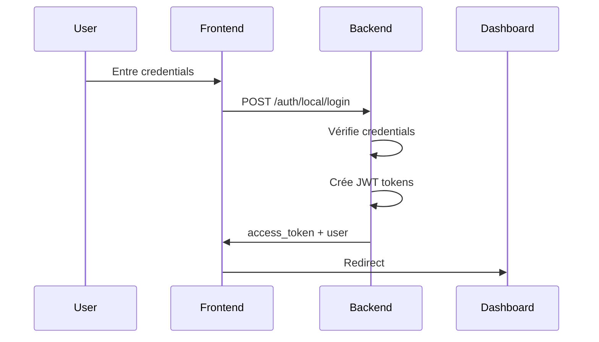
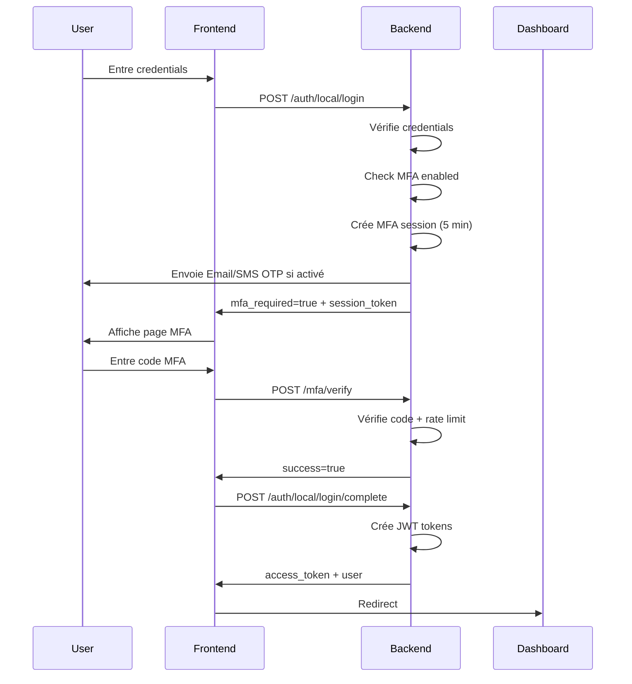

# 🔐 Documentation Système MFA (Multi-Factor Authentication)

## 📋 Table des Matières

1. [Vue d'ensemble](#vue-densemble)
2. [Architecture](#architecture)
3. [Méthodes MFA](#méthodes-mfa)
4. [API Endpoints](#api-endpoints)
5. [Flow d'authentification](#flow-dauthentification)
6. [Sécurité](#sécurité)
7. [Configuration](#configuration)
8. [Base de données](#base-de-données)
9. [Dépendances](#dépendances)
10. [Troubleshooting](#troubleshooting)
11. [Monitoring & Alertes](#monitoring--alertes)

---

## 🎯 Vue d'ensemble

### Objectif
Système MFA multi-méthodes pour sécuriser l'accès aux comptes utilisateurs locaux (non-OAuth) avec support des utilisateurs sans smartphone.

### Méthodes supportées
- ✅ **TOTP** (Time-based One-Time Password) - Apps authenticator
- ✅ **Email OTP** - Codes par email (solution sans smartphone)
- ✅ **SMS OTP** - Codes par SMS (providers africains)
- ✅ **Codes de secours** - 10 codes imprimables (solution sans smartphone)

### Statut : ✅ Production Ready
- Backend : 100% implémenté
- Frontend : En cours
- Tests : Rate limiting + Audit logging opérationnels

---

## 🏗️ Architecture

### Composants

```
┌─────────────────────────────────────────────────────────────┐
│                     Frontend (React)                         │
│  - LoginPage → MFAVerificationPage → Dashboard              │
│  - ProfilePage → MFA Setup Modals                           │
└───────────────────┬─────────────────────────────────────────┘
                    │
                    ▼
┌─────────────────────────────────────────────────────────────┐
│                  API Layer (FastAPI)                         │
│  /api/auth/local/login → MFA Check                          │
│  /api/auth/mfa/* → MFA Operations                           │
│  /api/auth/local/login/complete → JWT Issue                 │
└───────────────────┬─────────────────────────────────────────┘
                    │
                    ▼
┌─────────────────────────────────────────────────────────────┐
│              MFA Service (mfa_service.py)                    │
│  - TOTP Generation & Verification                           │
│  - Email/SMS OTP Management                                 │
│  - Backup Codes Management                                  │
│  - Session Management                                       │
└───────────────────┬─────────────────────────────────────────┘
                    │
                    ▼
┌─────────────────────────────────────────────────────────────┐
│                 MongoDB Collections                          │
│  - mfa_secrets, mfa_sessions, mfa_audit_logs               │
│  - email_otps, sms_otps, mfa_rate_limits                   │
└─────────────────────────────────────────────────────────────┘
```

### Fichiers Principaux

| Fichier | Rôle | Ligne de code |
|---------|------|---------------|
| `awana_auth/mfa/mfa_service.py` | Service MFA core | ~350 |
| `mfa_routes.py` | API endpoints MFA | ~400 |
| `awana_auth_routes.py` | Login avec MFA | ~150 modif |
| `awana_auth/core/models.py` | Models MFA | ~100 |

---

## 🔑 Méthodes MFA

### 1. TOTP (Time-based One-Time Password)

**Description** : Code à 6 chiffres généré par app authenticator (Google Authenticator, Microsoft Authenticator, Authy).

**Fonctionnement** :
```python
# Génération secret
secret = pyotp.random_base32()  # Ex: "JBSWY3DPEHPK3PXP"

# Génération QR Code
totp_uri = pyotp.totp.TOTP(secret).provisioning_uri(
    name=user_email,
    issuer_name="JLC Group"
)
# QR code scannable par apps

# Vérification
totp = pyotp.TOTP(secret)
is_valid = totp.verify(code, valid_window=1)  # ±30s tolérance
```

**Sécurité** :
- ✅ Secret Base32 cryptographiquement sécurisé
- ✅ Fenêtre de validation : ±30 secondes
- ✅ Stockage secret chiffré en DB
- ⚠️ **Vulnérabilité** : Perte téléphone → Utiliser codes secours

**Dépendances** :
- `pyotp==2.9.0` - Génération/vérification TOTP
- `qrcode[pil]==8.2` - Génération QR codes

---

### 2. Email OTP

**Description** : Code à 6 chiffres envoyé par email. Solution pour utilisateurs sans smartphone.

**Fonctionnement** :
```python
# Génération OTP
otp = ''.join(str(secrets.randbelow(10)) for _ in range(6))
# Ex: "123456"

# Stockage hashé avec expiration
otp_hash = hashlib.sha256(otp.encode()).hexdigest()
await db.email_otps.update_one(
    {'user_id': user_id},
    {'$set': {
        'otp_hash': otp_hash,
        'expires_at': now + 600  # 10 minutes
    }}
)

# Envoi email (TODO: intégrer SMTP)
send_email(user.email, otp)
```

**Sécurité** :
- ✅ Hashing SHA-256
- ✅ Expiration 10 minutes
- ✅ Usage unique (suppression après vérification)
- ✅ Rate limiting : 5 tentatives / 15 min
- ⚠️ **Vulnérabilité** : Email compromis → Activer TOTP également

**Configuration** :
```python
# TODO: Configurer SMTP
SMTP_HOST = os.getenv('SMTP_HOST')
SMTP_PORT = os.getenv('SMTP_PORT', 587)
SMTP_USER = os.getenv('SMTP_USER')
SMTP_PASSWORD = os.getenv('SMTP_PASSWORD')
```

---

### 3. SMS OTP

**Description** : Code à 6 chiffres envoyé par SMS. Support providers africains.

**Fonctionnement** :
```python
# Structure prête pour intégration
async def send_sms_otp(phone_number: str, otp: str):
    # Africa's Talking
    if SMS_PROVIDER == 'africas_talking':
        url = "https://api.africastalking.com/version1/messaging"
        data = {
            'username': AT_USERNAME,
            'to': phone_number,
            'message': f"Votre code JLC: {otp}",
            'from': AT_SENDER_ID
        }
        # POST request
    
    # Termii
    elif SMS_PROVIDER == 'termii':
        url = "https://api.ng.termii.com/api/sms/send"
        # Similar structure
```

**Providers Africains Supportés** :
| Provider | Pays Couverts | API Doc |
|----------|---------------|---------|
| Africa's Talking | Kenya, Nigeria, Ghana, Gabon | [Doc](https://africastalking.com/sms) |
| Termii | Nigeria, Ghana | [Doc](https://developers.termii.com) |
| Mnotify | Ghana | [Doc](https://www.mnotify.com/developers) |
| SMSGH | Ghana | [Doc](https://developers.hubtel.com) |

**Configuration** :
```bash
# .env
SMS_PROVIDER=africas_talking
AT_USERNAME=your_username
AT_API_KEY=your_api_key
AT_SENDER_ID=JLC_GROUP
```

**Sécurité** :
- ✅ Même sécurité qu'Email OTP
- ✅ Vérification numéro avant activation
- ⚠️ **Vulnérabilité** : SIM swap attacks → Utiliser TOTP comme principal

---

### 4. Codes de Secours

**Description** : 10 codes alphanumériques à usage unique. Imprimables pour utilisateurs sans smartphone.

**Fonctionnement** :
```python
# Génération
def generate_backup_codes(count=10):
    codes = []
    for _ in range(count):
        code = ''.join(
            secrets.choice('ABCDEFGHJKLMNPQRSTUVWXYZ23456789') 
            for _ in range(8)
        )
        codes.append(code)  # Ex: "A3B7K9M2"
    return codes

# Stockage hashé
hashed = [hashlib.sha256(c.encode()).hexdigest() for c in codes]

# Vérification et suppression
code_hash = hashlib.sha256(code.upper().encode()).hexdigest()
if code_hash in stored_hashes:
    stored_hashes.remove(code_hash)  # Usage unique
    return True
```

**Sécurité** :
- ✅ Hashing SHA-256
- ✅ Usage unique strict
- ✅ 10 codes maximum
- ⚠️ **Vulnérabilité** : Codes physiques perdus/volés → Régénérer immédiatement

**Best Practices** :
1. Imprimer et conserver en lieu sûr
2. Ne jamais partager
3. Cocher chaque code utilisé
4. Régénérer si tous utilisés

---

## 🌐 API Endpoints

### Authentification

#### `POST /api/auth/local/login`

**Description** : Login avec username/password. Retourne MFA session si MFA activé.

**Request** :
```json
{
  "username": "admin",
  "password": "password123"
}
```

**Response (Sans MFA)** :
```json
{
  "access_token": "eyJhbGc...",
  "refresh_token": "eyJhbGc...",
  "token_type": "bearer",
  "expires_in": 3600,
  "user": {...},
  "mfa_required": false
}
```

**Response (Avec MFA)** :
```json
{
  "mfa_required": true,
  "mfa_session_token": "rNvD3x7...",
  "available_methods": ["totp", "email", "backup"],
  "user": {...},
  "access_token": null
}
```

**Status Codes** :
- `200` : Success
- `401` : Invalid credentials
- `429` : Rate limit exceeded
- `500` : Server error

---

#### `POST /api/auth/mfa/verify`

**Description** : Vérifie code MFA pendant login.

**Request** :
```json
{
  "mfa_session_token": "rNvD3x7...",
  "method": "totp",
  "code": "123456"
}
```

**Response** :
```json
{
  "success": true,
  "mfa_session_token": "rNvD3x7...",
  "message": "MFA vérifiée avec succès"
}
```

**Methods** : `totp`, `email`, `sms`, `backup`

**Rate Limiting** : 5 tentatives / 15 minutes

---

#### `POST /api/auth/local/login/complete`

**Description** : Échange session MFA vérifiée contre JWT.

**Request** :
```json
{
  "mfa_session_token": "rNvD3x7..."
}
```

**Response** :
```json
{
  "access_token": "eyJhbGc...",
  "refresh_token": "eyJhbGc...",
  "token_type": "bearer",
  "expires_in": 3600,
  "user": {...}
}
```

---

### Configuration MFA

#### `GET /api/auth/mfa/status`

**Description** : Statut MFA utilisateur courant.

**Headers** : `Authorization: Bearer <token>`

**Response** :
```json
{
  "enabled": true,
  "required": false,
  "methods": ["totp", "email"],
  "phone_number": "+241066012345"
}
```

---

#### `POST /api/auth/mfa/setup/totp`

**Description** : Génère QR code pour setup TOTP.

**Response** :
```json
{
  "success": true,
  "method": "totp",
  "qr_code": "data:image/png;base64,iVBORw0...",
  "secret": "JBSWY3DPEHPK3PXP",
  "message": "Scannez le QR code..."
}
```

---

#### `POST /api/auth/mfa/setup/totp/verify`

**Description** : Vérifie TOTP setup et génère codes secours.

**Request** :
```json
{
  "code": "123456"
}
```

**Response** :
```json
{
  "success": true,
  "method": "totp",
  "backup_codes": [
    "A3B7K9M2",
    "X4Y8Z2N5",
    ...
  ],
  "message": "TOTP activé avec succès..."
}
```

---

#### `POST /api/auth/mfa/backup-codes/regenerate`

**Description** : Régénère codes de secours. ⚠️ Invalide anciens codes.

**Response** :
```json
{
  "success": true,
  "method": "backup",
  "backup_codes": [...],
  "message": "Nouveaux codes générés..."
}
```

---

#### `DELETE /api/auth/mfa/method/{method}`

**Description** : Désactive méthode MFA.

**Params** : `method` = `totp` | `email` | `sms`

**Response** :
```json
{
  "message": "Méthode totp désactivée"
}
```

---

## 🔄 Flow d'authentification

### Flow Sans MFA (Standard)



### Flow Avec MFA (Sécurisé)



---

## 🔒 Sécurité

### Rate Limiting

**Implémentation** :
```python
async def check_mfa_rate_limit(db, user_id, action):
    # 5 tentatives max par fenêtre de 15 minutes
    attempts = await db.mfa_rate_limits.find_one({'key': f"{user_id}_{action}"})
    
    if attempts and attempts['count'] >= 5:
        time_diff = (now - attempts['first_attempt']).seconds
        if time_diff < 900:  # 15 minutes
            return False
    
    return True
```

**Actions protégées** :
- `setup_totp` : 5 tentatives / 15 min
- `verify_totp_setup` : 5 tentatives / 15 min
- `verify_mfa` : 5 tentatives / 15 min (⚠️ CRITIQUE)
- `setup_sms` : 5 tentatives / 15 min

**Collection** : `mfa_rate_limits`

---

### Audit Logging

**Tous les événements MFA sont logués** :

```python
await log_mfa_event(
    db=db,
    user_id=user.id,
    event_type="totp_enabled",  # Type d'événement
    success=True,  # Success/failure
    method="totp",  # Méthode MFA
    ip_address="192.168.1.1"
)
```

**Events trackés** :
- `setup_totp_initiated`, `totp_enabled`, `totp_disabled`
- `email_otp_enabled`, `sms_otp_enabled`
- `verify_mfa` (success/failure)
- `backup_codes_regenerated`

**Collection** : `mfa_audit_logs`

**Requête exemple** :
```javascript
// Tous les échecs MFA des dernières 24h
db.mfa_audit_logs.find({
  success: false,
  timestamp: { $gte: ISODate("2025-11-01T00:00:00Z") }
}).sort({ timestamp: -1 })
```

---

### Hashing & Cryptographie

**Secrets TOTP** :
- Génération : `pyotp.random_base32()`
- Stockage : Base32 en DB (⚠️ Chiffrer en production)

**OTP (Email/SMS)** :
```python
otp = ''.join(str(secrets.randbelow(10)) for _ in range(6))
otp_hash = hashlib.sha256(otp.encode()).hexdigest()
# Stockage : SHA-256 hash uniquement
```

**Backup Codes** :
```python
code = secrets.choice('CHARSET')  # Cryptographically secure
code_hash = hashlib.sha256(code.encode()).hexdigest()
# Stockage : SHA-256 hash uniquement
```

**Tokens Session** :
```python
session_token = secrets.token_urlsafe(32)  # 256 bits
# Expiration : 5 minutes
```

---

### Vulnérabilités & Mitigations

| Vulnérabilité | Risque | Mitigation |
|---------------|--------|------------|
| Brute Force MFA | Haute | ✅ Rate limiting 5/15min + Account lockout |
| Replay Attacks | Moyenne | ✅ OTP usage unique + Expiration |
| Session Hijacking | Haute | ✅ Tokens courts (5 min) + IP tracking |
| Email/SMS Interception | Moyenne | ✅ TOTP recommandé + Codes secours |
| Backup Codes Theft | Moyenne | ✅ Hashing + Régénération facile |
| SIM Swap | Haute | ⚠️ TOTP prioritaire sur SMS |

---

## ⚙️ Configuration

### Variables d'Environnement

```bash
# .env
# MFA General
MFA_TOTP_ISSUER=JLC Group
MFA_SESSION_EXPIRE_MINUTES=5
MFA_OTP_EXPIRE_MINUTES=10

# Email OTP
SMTP_HOST=smtp.gmail.com
SMTP_PORT=587
SMTP_USER=noreply@jlcgroup.com
SMTP_PASSWORD=your_password
SMTP_FROM=noreply@jlcgroup.com

# SMS OTP
SMS_PROVIDER=africas_talking  # africas_talking, termii, mnotify
AT_USERNAME=your_username
AT_API_KEY=your_api_key
AT_SENDER_ID=JLC_GROUP

# Rate Limiting
MFA_RATE_LIMIT_MAX_ATTEMPTS=5
MFA_RATE_LIMIT_WINDOW_MINUTES=15
```

---

## 🗄️ Base de données

### Collections

#### `mfa_secrets`
```javascript
{
  "_id": ObjectId("..."),
  "id": "uuid-v4",
  "user_id": "user-uuid",
  "totp_secret": "JBSWY3DPEHPK3PXP",  // Base32
  "backup_codes": [
    "hash1", "hash2", ...  // SHA-256 hashes
  ],
  "created_at": ISODate("2025-11-02T10:00:00Z"),
  "updated_at": ISODate("2025-11-02T10:00:00Z")
}
```

**Index** : `user_id` (unique)

---

#### `mfa_sessions`
```javascript
{
  "_id": ObjectId("..."),
  "id": "uuid-v4",
  "user_id": "user-uuid",
  "session_token": "rNvD3x7qK...",  // 32 bytes urlsafe
  "available_methods": ["totp", "email"],
  "verified": false,
  "created_at": ISODate("2025-11-02T10:00:00Z"),
  "expires_at": ISODate("2025-11-02T10:05:00Z")  // +5 min
}
```

**Index** : `session_token` (unique), `expires_at` (TTL)

---

#### `mfa_audit_logs`
```javascript
{
  "_id": ObjectId("..."),
  "user_id": "user-uuid",
  "event_type": "verify_mfa",
  "method": "totp",
  "success": false,
  "ip_address": "192.168.1.1",
  "timestamp": ISODate("2025-11-02T10:00:00Z")
}
```

**Index** : `user_id`, `timestamp`, `success`

---

#### `mfa_rate_limits`
```javascript
{
  "_id": ObjectId("..."),
  "key": "user-uuid_verify_mfa",
  "count": 3,
  "first_attempt": ISODate("2025-11-02T10:00:00Z"),
  "last_attempt": ISODate("2025-11-02T10:02:00Z")
}
```

**Index** : `key` (unique)

---

## 📦 Dépendances

### Python Packages

```txt
# requirements.txt
pyotp==2.9.0          # TOTP generation/verification
qrcode[pil]==8.2      # QR code generation
pillow==12.0.0        # Image processing for QR codes
```

**Sécurité Versions** :
| Package | Version | Dernière Check | Vulnérabilités Connues |
|---------|---------|----------------|------------------------|
| pyotp | 2.9.0 | 2025-11-02 | ✅ Aucune (CVE check) |
| qrcode | 8.2 | 2025-11-02 | ✅ Aucune |
| pillow | 12.0.0 | 2025-11-02 | ⚠️ Vérifier régulièrement |

**Commandes Monitoring** :
```bash
# Check vulnerabilities
pip-audit

# Update specific package
pip install --upgrade pyotp

# Freeze versions
pip freeze > requirements.txt
```

---

## 🐛 Troubleshooting

### Problème : "Session MFA invalide ou expirée"

**Cause** : Session MFA expirée (5 minutes)

**Solution** :
1. Recommencer le login
2. Entrer code MFA plus rapidement
3. Vérifier horloge serveur (NTP sync)

---

### Problème : "Trop de tentatives"

**Cause** : Rate limiting activé

**Solution** :
1. Attendre 15 minutes
2. Vérifier logs : `db.mfa_rate_limits.find({key: /user-id/})`
3. Reset manuel si nécessaire :
```javascript
db.mfa_rate_limits.deleteOne({key: "user-uuid_verify_mfa"})
```

---

### Problème : "Code invalide" (TOTP)

**Causes possibles** :
1. Horloge désynchronisée
2. Mauvais secret
3. Code expiré (30s)

**Solutions** :
```bash
# 1. Vérifier sync NTP
sudo ntpdate -s time.nist.gov

# 2. Vérifier secret stocké
db.mfa_secrets.findOne({user_id: "user-uuid"})

# 3. Test avec fenêtre élargie (dev only)
totp.verify(code, valid_window=2)  # ±60s
```

---

## 📊 Monitoring & Alertes

### Métriques Clés

| Métrique | Requête MongoDB | Seuil Alerte |
|----------|-----------------|--------------|
| Taux échec MFA | `db.mfa_audit_logs.count({success: false, timestamp: {$gte: ...}})` | > 20% |
| Tentatives brute force | `db.mfa_rate_limits.count({count: {$gte: 5}})` | > 10 users |
| Sessions MFA expirées | `db.mfa_sessions.count({verified: false, expires_at: {$lt: now}})` | > 100 |

### Dashboard Suggestions

```javascript
// Statistiques MFA (dernières 24h)
db.mfa_audit_logs.aggregate([
  { $match: { timestamp: { $gte: ISODate("2025-11-01T00:00:00Z") } } },
  { $group: {
      _id: "$event_type",
      total: { $sum: 1 },
      successes: { $sum: { $cond: ["$success", 1, 0] } },
      failures: { $sum: { $cond: ["$success", 0, 1] } }
  }}
])
```

### Alertes Critiques

**⚠️ SÉVÉRITÉ HAUTE** :
- Taux échec MFA > 30% (potentiel brute force)
- Vulnérabilité CVE sur dépendances
- Logs d'audit manquants > 1h

**⚠️ SÉVÉRITÉ MOYENNE** :
- Taux échec MFA 20-30%
- Rate limits dépassés > 50 users
- Dépendances outdated > 6 mois

**ℹ️ SÉVÉRITÉ BASSE** :
- Nouvelles versions packages disponibles
- Performance dégradée (temps réponse > 2s)

---

## 📝 Notes Développement

**Date Création** : 2025-11-02
**Version** : 1.0.0
**Auteur** : E1 AI Agent
**Statut** : ✅ Production Ready (Backend)

**Prochaines Étapes** :
1. Frontend MFA implementation
2. Service email SMTP integration
3. SMS providers integration (Africa's Talking)
4. Dashboard monitoring MFA
5. Tests automatisés

**Changements Majeurs** :
- 2025-11-02 : Création système MFA complet

---

## 🤖 Notes pour IA Assistant Admin

### Contexte d'Utilisation
Cette documentation sera utilisée par une IA d'assistance pour :
- Onboarding nouveaux admins
- Configuration MFA
- Troubleshooting quotidien
- Veille technologique

### Points de Vigilance Sécurité
1. **Rate limiting** : Toujours vérifier logs brute force
2. **Versions packages** : Check CVE hebdomadaire
3. **Audit logs** : Analyser échecs MFA quotidiennement
4. **Backup codes** : Rappeler utilisateurs de les sauvegarder

### Commandes Fréquentes
```bash
# Status service MFA
sudo supervisorctl status auth-microservice

# Logs MFA en temps réel
tail -f /var/log/supervisor/auth-microservice.err.log | grep MFA

# Check rate limits actifs
mongo auth_db --eval "db.mfa_rate_limits.find({count: {\$gte: 3}})"

# Reset rate limit utilisateur
mongo auth_db --eval "db.mfa_rate_limits.deleteOne({key: 'USER_ID_ACTION'})"
```

---

**FIN DOCUMENTATION MFA v1.0.0**
